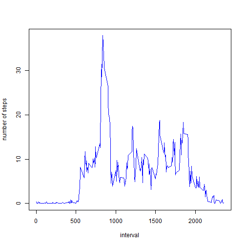

# Reproducible Research: Peer Assessment 1
==========================================

## Loading and preprocessing the data

```r
library(data.table)
library(ggplot2)
Sys.setlocale("LC_TIME", "English") #to get the dates to appear in english
```

```
## [1] "English_United States.1252"
```

```r
data <- read.csv("activity.csv", colClasses = c("numeric", "Date", "numeric"))
good_data <- data.table(data, key='date') #key makes it run faster then if i would just make a data.table, great for BIG files
steps_per_day <- good_data[,list(steps=sum(steps,na.rm=TRUE)), by='date'] #preprocessed data for the ggplot
ggplot(steps_per_day,aes(x=date,y=steps))+geom_bar(stat='identity') #makes the ggplot histogram
```

 

## What is mean total number of steps taken per day?
The mean is given by:


```r
mean(steps_per_day$steps)
```

```
## [1] 9354
```

and the median of total steps per day is:


```r
median(steps_per_day$steps)
```

```
## [1] 10395
```

## What is the average daily activity pattern?
Here I process the data to produce a table with intervals and steps as rows for easier plotting:


```r
good_data <- data.table(data, key='interval')
steps_per_interval <- good_data[,list(steps=sum(steps,na.rm=TRUE)/288), by='interval']
plot(steps_per_interval, ylab= "number of steps", type="l", col="blue")
```

 

Here I calculate the interval with the maximum number of steps:


```r
steps_per_interval$interval[which.max(steps_per_interval$steps)]
```

```
## [1] 835
```

## Imputing missing values

The number of rows(which corresponds to intervals) with missing values is:


```r
sum(is.na(data))
```

```
## [1] 2304
```

I will exchange all the missing values with a mean value of steps per interval which is:


```r
mean(steps_per_interval$steps)
```

```
## [1] 6.879
```

Now I am making a dataset with the filled in missing values:


```r
good_data_filled <-data.table(good_data,key="date")
good_data_filled$steps[is.na(good_data_filled$steps)] <- mean(steps_per_interval$steps)
```

And finally time to plot the imputed dataset:


```r
steps_per_day_imputed <- good_data_filled[,list(steps=sum(steps,na.rm=TRUE)), by='date'] 
ggplot(steps_per_day_imputed,aes(x=date,y=steps))+geom_bar(stat='identity') 
```

 

Because of imputation the mean numer of steps per day has changed, while the median hasn't:


```r
mean(steps_per_day_imputed$steps)
```

```
## [1] 9614
```

```r
median(steps_per_day_imputed$steps)
```

```
## [1] 10395
```

When you impute missing data there will be a slightly positive change in the mean of the data since we exchange all NA's with positive values.

## Are there differences in activity patterns between weekdays and weekends?

Here I am adding a column with the "weekend" or "weekday" value according to the date in the imputed dataset:


```r
library(plyr)
good_data_filled$day <- weekdays(good_data_filled$date)
good_data_filled$day <- mapvalues(good_data_filled$day,
                                  from = c("Monday", "Tuesday","Wednesday","Thursday","Friday","Saturday","Sunday"),
                                  to = c('Weekday','Weekday','Weekday','Weekday','Weekday','Weekend','Weekend'))
```

And finally the panel plot containing a time series plot (i.e. type = "l") of the 5-minute interval (x-axis) and the average number of steps taken, averaged across all weekday days or weekend days (y-axis).


```r
library(lattice)
steps_per_interval_imputed <- good_data_filled[,list(steps=sum(steps)/288), by=c('interval','day')]
xyplot(steps ~ interval | day, data = steps_per_interval_imputed,type="l", col="blue",
       xlab="Interval",ylab="Number of steps",layout = c(1, 2)) 
```

 

